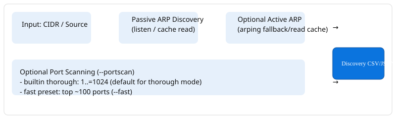

# Network Scanner 🔎🦀

[](https://github.com/xuoxod/network_scanner/releases)
[](https://github.com/xuoxod/network_scanner/actions)
[](LICENSE)
[](https://www.rust-lang.org)
[](BUILDING.md)

High-performance, auditable local network discovery and diagnostic toolkit written in pure Rust. Built on a strict **passive-first invariant**, deterministic data contracts, and zero-bloat standalone binaries.



---

## ⚡ Core Philosophy & Directives

1. **Passive-First Default**: By default, discovery operates completely passively by inspecting the local kernel ARP table (`/proc/net/arp` and `ip neigh`). Zero unsolicited packets are transmitted onto the wire unless active probes (`--probe`) or port scans (`--portscan`) are explicitly enabled.
2. **Canonical Data Contracts (`CONTRACTS.md`)**: Output is guaranteed to adhere to machine-readable formats (uniform 6-column CSV, Canonical JSON, Target JSON, and Legacy JSON) across all tools.
3. **Embedded IEEE OUI Vendor Database**: Hardware MAC addresses are resolved to manufacturer names in memory via an embedded in-tree IEEE OUI table with zero external API calls or network latency.
4. **Standalone Portability**: Compiles to standalone static-pie binaries via `musl` (`~2.0 MB`) requiring zero runtime dependencies, dynamically linked libraries, or glibc versions.
5. **Non-Privileged Diagnostics**: Includes `netcheck` to inspect local egress, default gateway reachability, and network interface status without requiring elevated privileges.

---

## 🏗️ Workspace Layout & Crate Registry

The workspace is organized under strict separation of concerns:

| Crate | Purpose | Primary Components |
| :--- | :--- | :--- |
| **[`discovery`](crates/discovery)** | Discovery engine & command-line interface | `LiveArpDiscover`, `discovery-cli` binary, portscan coordinator |
| **[`netutils`](crates/netutils)** | Low-level networking & diagnostics | Interface enumeration, ARP parser/prober, TCP connect port scanner, `netcheck` binary |
| **[`io`](crates/io)** | Data adapters & OUI vendor resolver | Embedded IEEE OUI database, CSV / Target JSON / Legacy JSON serializers |
| **[`formats`](crates/formats)** | Canonical data contracts | `DiscoveryRecord`, Serde roundtrip converters, schema validators |
| **[`enrich`](crates/enrich)** | Metadata enrichment heuristics | Vendor and device classification from hostnames and banners |

```text
network_scanner/
├── Cargo.toml            # Workspace manifest (resolver = "2")
├── Makefile              # Build, test, and static musl packaging targets
├── CONTRACTS.md          # Canonical schema & format definitions
├── BUILDING.md           # Compilation guide (native, musl, cross)
├── crates/
│   ├── discovery/        # Engine & discovery-cli binary
│   ├── netutils/         # Low-level networking & netcheck binary
│   ├── io/               # Adapters, OUI vendor lookup & oui.csv
│   ├── formats/          # DiscoveryRecord schema contract
│   └── enrich/           # Metadata enrichment heuristics
└── scripts/              # Helper automation scripts
```

---

## 🚀 Quickstart

### 1. Pre-Flight Connectivity Check (`netcheck`)

Run non-privileged diagnostics to verify local outbound IP, interface status, default CIDR, and gateway reachability:

```bash
cargo run --bin netcheck
```

Example output:
```text
=== Network Scanner — NetCheck Connectivity Diagnostic ===
  Local Outbound IP: 192.168.1.160
  Primary Interface: wlp2s0 (IPv4: 192.168.1.160, MAC: 04:ea:56:9d:4f:cc, State: UP)
  Detected Local CIDR: 192.168.1.160/24
  Gateway Check (192.168.1.1): REACHABLE (TCP 80/443)
  Outbound Egress (1.1.1.1:53): REACHABLE
===========================================================
```

### 2. Passive Local Subnet Discovery (`discovery-cli`)

Discovers live hosts from the local ARP cache without sending a single probe packet. Automatically detects your primary interface CIDR when omitted:

```bash
# Auto-detect local subnet and export to CSV
cargo run --bin discovery-cli

# Explicit CIDR range with companion JSON files
cargo run --bin discovery-cli -- 192.168.1.0/24 --out results.csv --json
```

### 3. Active ARP Probes & Port Scanning (Opt-In)

> [!NOTE]
> Active network probing transmits packets on the local link. Use only on networks you own or have explicit authorization to scan.

```bash
# Fast port scan (~100 common ports) on discovered hosts
cargo run --bin discovery-cli -- 192.168.1.0/24 --portscan --fast

# Specific port list and ranges with custom timeout
cargo run --bin discovery-cli -- 192.168.1.0/24 --portscan --ports 22,80,443,8000-8080 --timeout 2

# Active ARP probing (requires root/sudo for raw socket or arping)
sudo -E cargo run --bin discovery-cli -- 192.168.1.0/24 --probe --portscan
```

---

## 📖 CLI Reference (`discovery-cli`)

```text
Usage: discovery-cli [OPTIONS] [CIDR]

Arguments:
  [CIDR]  CIDR range to scan (e.g. 192.168.1.0/24). Auto-detects primary CIDR if omitted

Options:
      --probe                  Enable active ARP probes (requires elevated privileges)
      --portscan               Enable TCP port scanning on discovered hosts (off by default)
      --fast                   Fast port preset: scan top ~100 common ports
      --ports <PORTS>          Explicit port list or range to scan (e.g. "22,80,443,8000-8080")
      --concurrency <N>        Number of concurrent worker threads [default: 64]
      --timeout <SECS>         Per-target / per-port timeout in seconds [default: 1]
  -o, --out <FILE>             Output CSV file path [default: discovery_results.csv]
      --json                   Generate companion JSON outputs (.json, .target.json, .legacy.json)
      --out-target <FILE>      Write target-compatible JSON to specified file
      --out-legacy <FILE>      Write legacy-shaped JSON to specified file
      --all                    Include all addresses in CIDR range (default: discovered hosts only)
  -h, --help                   Print help information
  -V, --version                Print version information
```

---

## 📊 Output Formats & Schemas

### 1. Canonical CSV (`discovery_results.csv`)
Uniform 6-column machine-readable format:
```csv
ip,port,banner,mac,vendor,timestamp
192.168.1.1,80,,78:67:0e:ba:7e:74,TP-Link Technologies Co.,,
192.168.1.1,443,,78:67:0e:ba:7e:74,TP-Link Technologies Co.,,
192.168.1.159,80,,64:4e:d7:3b:72:5a,HP Inc.,
192.168.1.160,,,04:ea:56:9d:4f:cc,ASUSTek COMPUTER INC.,
```

### 2. Target-Compatible JSON (`<basename>.target.json`)
Streamlined JSON for modern downstream ingestion pipelines:
```json
[
  {
    "ip": "192.168.1.159",
    "mac": "64:4e:d7:3b:72:5a",
    "vendor": "HP Inc.",
    "method": "arp_passive",
    "ports": [80, 443],
    "is_up": true
  }
]
```

### 3. Legacy Netscan JSON (`<basename>.legacy.json`)
Drop-in backwards-compatible format preserving historical telemetry field names:
```json
[
  {
    "IP": "192.168.1.159",
    "MAC": "64:4e:d7:3b:72:5a",
    "Vendor": "HP Inc.",
    "ports": [80, 443],
    "banners": [],
    "is_up": true,
    "Method": "arp_passive"
  }
]
```

---

## 🛠️ Build & Installation

### Standard Workspace Build

```bash
# Build all binaries in release mode
cargo build --release

# Run all workspace unit and integration tests
cargo test --workspace
```

Binaries will be placed in `target/release/`:
* `target/release/discovery-cli`
* `target/release/netcheck`

### Static Musl Compilation (Zero Dependencies)

Produces standalone static-pie binaries that run across any Linux distribution without glibc dependencies:

```bash
# Using Makefile
make musl

# Or directly with Cargo
cargo build --release --target x86_64-unknown-linux-musl
```

Static binaries are located at:
* `target/x86_64-unknown-linux-musl/release/discovery-cli`
* `target/x86_64-unknown-linux-musl/release/netcheck`

---

## 🧪 Testing & Verification

The suite includes comprehensive unit tests, golden file verifiers, and simulated ARP fixtures:

```bash
# Run full test suite across all 5 crates
cargo test --workspace

# Run integration tests specifically
cargo test --test portscan_integration
cargo test --test cli_companion_test
```

---

## 📜 License

Licensed under the MIT License. See [LICENSE](LICENSE) for details.
