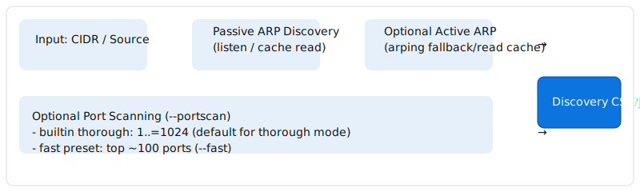

# Discovery




Discovery crate — ARP-based discovery and opt-in probing. This crate exposes a library API and a small CLI for running local network discovery. Examples use generic placeholders (do not paste system-specific values).

## Key behaviors

1. Passive ARP discovery is the default (no active probes).
2. Enable active ARP probes with `--probe` (permission required).
3. Enable TCP port scanning with `--portscan` (off by default; builtin ports cover 1..=1024). Use `--fast` for a smaller preset (~100 ports).

## Quick examples

Build the CLI in release mode:

```bash
cd /path/to/network_scanner
cargo build -p discovery --bin discovery-cli --release
```

Passive discovery (no active probes):

```bash
cargo run -p discovery --bin discovery-cli -- 10.0.0.0/24 --out results.csv
```

Opt-in active scan (only on networks you control):

```bash
# may require elevated privileges for ARP probes
sudo -E cargo run -p discovery --bin discovery-cli -- 10.0.0.0/24 --probe --portscan --out active.csv
```

## Tests

```bash
cargo test -p discovery
```

Integration test (loopback portscan):

```bash
cargo test --manifest-path crates/discovery/Cargo.toml --test portscan_integration
```

## Output formats

- CSV (default)
- JSON (enable with `--json`)

When JSON output is requested the CLI will produce companion files:

- A neutral, target-compatible companion `<basename>.target.json` (see crate `io` helpers). This JSON is pretty-printed and shaped for consumption by the rmediatech Go webapp and other downstream tools.

- A legacy-shaped companion `<basename>.legacy.json` compatible with the historical netscan schema (includes fields found in the CSV plus arrays for `ports` and `banners`, a `Method` value, and `is_up`). This file is useful when integrating with legacy pipelines that expect the old keys and layout.

You can control where these companions are written using CLI flags:

- `--out-target <FILE>` — write the target-compatible JSON to `<FILE>`.
- `--out-legacy <FILE>` — write the legacy-shaped JSON to `<FILE>`.

If those flags are omitted, the CLI emits `<basename>.target.json` and `<basename>.legacy.json` next to the CSV output when `--json` is used.

## Diagrams

- `crates/discovery/docs/images/discovery-flow.svg`
- `crates/discovery/docs/images/portscan-strategy.svg`

Refer to the crate source for full API docs and examples.

## Build (quick)

From repository root, build the discovery binary in release mode:

```bash
cargo build --manifest-path crates/discovery/Cargo.toml --bin discovery-cli --release
```

To build as a library (release):

```bash
cargo build --manifest-path crates/discovery/Cargo.toml --lib --release
```

### 🔎 discovery


Discovery crate — ARP-based discovery and opt-in probing

  

This crate exposes a library API and a small CLI for running local network
discovery. Examples use generic placeholders (do not paste system-specific
values).

## Details

A focused crate that provides ARP-based host discovery and optional, opt-in
TCP port probing. The crate exposes a library API and a small CLI. All
examples here use generic placeholders to avoid leaking system-specific
information.

## Behavior highlights

1. Passive ARP discovery is the default (no active probes).
1. Enable active ARP probes with `--probe` (permission required).
1. Enable TCP port scanning with `--portscan` (off by default; builtin
   ports cover 1..=1024). Use `--fast` for a smaller preset (~100 ports).

```bash
cargo test -p discovery
# Discovery


Discovery crate — ARP-based discovery and opt-in probing.

  

This crate exposes a library API and a small CLI for running local network


Discovery crate — ARP-based discovery and opt-in probing. This crate exposes a library API and a small CLI for running local network discovery. Examples use generic placeholders (do not paste system-specific values).

## Key behaviors

1. Passive ARP discovery is the default (no active probes).
2. Enable active ARP probes with `--probe` (permission required).
3. Enable TCP port scanning with `--portscan` (off by default; builtin ports cover 1..=1024). Use `--fast` for a smaller preset (~100 ports).

## Quick examples

Build the CLI in release mode:

```bash
cd /path/to/network_scanner
cargo build -p discovery --bin discovery-cli --release
```

Passive discovery (no active probes):

```bash
cargo run -p discovery --bin discovery-cli -- 10.0.0.0/24 --out results.csv
```

Opt-in active scan (only on networks you control):

```bash
# may require elevated privileges for ARP probes
sudo -E cargo run -p discovery --bin discovery-cli -- 10.0.0.0/24 --probe --portscan --out active.csv
```
