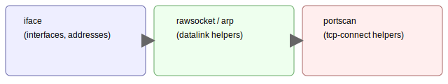

# 🧰 netutils



Netutils — low-level network helpers

  

This crate contains small, focused helpers used by other crates in the
workspace. Examples use generic placeholders to avoid leaking system-specific
information.

Key modules

1. `iface` — enumerate and normalize network interfaces.
1. `rawsocket` / `arp` — datalink helpers (use with care; some features may
   require elevated privileges).
1. `portscan` — TCP connect port scanning helpers (non-privileged by
   default).
1. `netcheck` — non-privileged connectivity checks and startup heuristics.

<p align="center">
  
  
  
</p>

# Netutils

Netutils contains low-level network helpers used by other crates in the workspace. Examples use generic placeholders to avoid leaking system-specific information.


## Key modules

1. `iface` — enumerate and normalize network interfaces.
2. `rawsocket` / `arp` — datalink helpers (use with care; some features may require elevated privileges).
3. `portscan` — TCP connect port scanning helpers (non-privileged by default).
4. `netcheck` — non-privileged connectivity checks and startup heuristics.

## Quick runtime check

```bash
cd /path/to/network_scanner
cargo run --manifest-path crates/netutils/Cargo.toml --bin netcheck
```

## Tests

```bash
cargo test -p netutils
```

## Build (quick)

From repository root, build the netutils library in release mode:

```bash
cargo build --manifest-path crates/netutils/Cargo.toml --lib --release
```

To build the `netcheck` binary in release mode:

```bash
cargo build --manifest-path crates/netutils/Cargo.toml --bin netcheck --release
```
