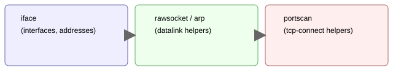

# netutils 🧰

[](https://github.com/xuoxod/network_scanner/actions)
[](../../LICENSE)

Low-level networking primitives, interface introspection, ARP resolvers, and diagnostic utilities.



---

## Core Modules

1. **`iface`**: Enumerate and normalize system network interfaces, IP addresses, MAC addresses, and determine default routing interfaces and CIDR subnets.
2. **`arp`**: Parse Linux `/proc/net/arp` and `ip neigh` cache, execute targeted unicast ARP probes via `arping`/`ping` fallback, and parse binary MAC structures.
3. **`portscan`**: High-concurrency asynchronous/threaded TCP connect port scanner.
4. **`cidrsniffer`**: CIDR expansion, worker chunk partitioning, and multi-threaded ARP cache/probe scanning.
5. **`netcheck`**: Non-privileged connectivity checks and startup heuristics.
6. **`rawsocket`**: Datalink layer packet transmission and reception helpers.

---

## Quick Diagnostic Check (`netcheck`)

Run non-privileged network checks to diagnose egress and gateway reachability:

```bash
cargo run --bin netcheck
```

Example output:
```text
=== Network Scanner — NetCheck Connectivity Diagnostic ===
  Local Outbound IP: 192.168.1.160
  Primary Interface: wlp2s0 (IPv4: 192.168.1.160, MAC: 04:ea:56:9d:4f:cc, State: UP)
  Detected Local CIDR: 192.168.1.160/24
  Gateway Check (192.168.1.1): REACHABLE (TCP 80/443)
  Outbound Egress (1.1.1.1:53): REACHABLE
===========================================================
```

---

## Build & Test

```bash
# Run all 19 netutils unit tests
cargo test -p netutils

# Build netcheck in release mode
cargo build --release --bin netcheck
```
